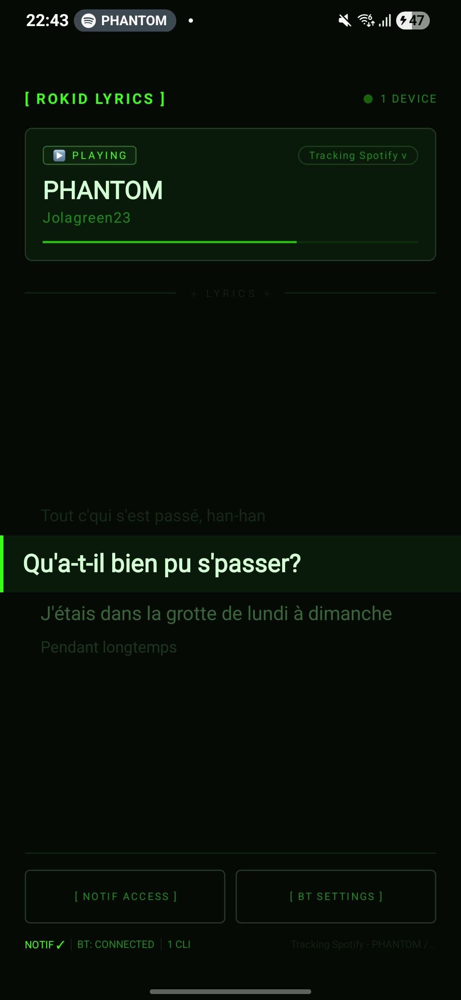
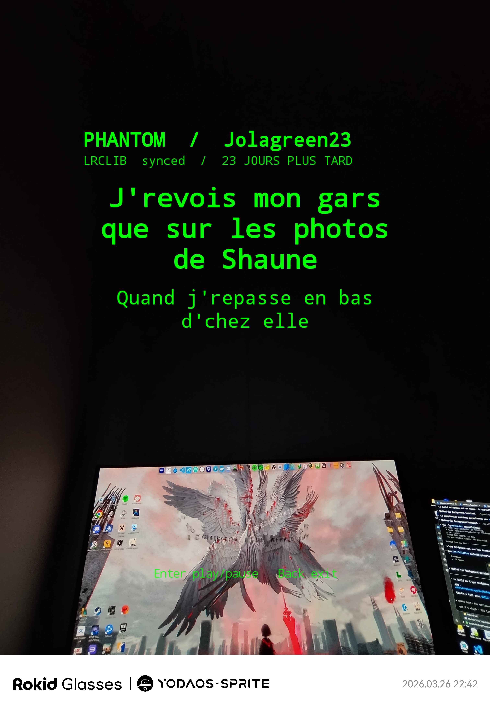

## Rokid Lyrics

<p align="center">
  
</p>

<p align="center">
  Synced lyrics on Rokid AR glasses, streamed live from your phone over Bluetooth.
</p>

---

## Screenshots

<p align="center">
  
  &nbsp;&nbsp;&nbsp;&nbsp;
  
</p>
<p align="center">
  <em>Phone companion app · Rokid Glasses live display</em>
</p>

---

## Latest update

The biggest recent chantier was turning the phone app into a real multi-provider lyrics pipeline instead of a single-source prototype.

- Added a provider chain on the phone: `Musixmatch -> Netease -> LRCLIB`
- Added optional Musixmatch sign-in and provider-aware status in the phone UI
- Improved lookup reliability so one track change triggers one real lookup instead of repeated retries
- Kept already loaded lyrics on screen when a refresh for the same track fails
- Removed the hidden Spotify preference in media session selection so the app behaves better with other players
- Cleaned up fallback messaging so a failed provider does not pollute the final status when another provider succeeds

---

## How it works

The phone app watches the active Android media session, detects the current track, fetches synced lyrics from a provider chain, and streams the result to the glasses over Bluetooth Classic SPP.

Current provider order:

1. `Musixmatch` as the main authenticated provider
2. `Netease` as the secondary fallback
3. `LRCLIB` as the public final fallback

When the glasses connect, they receive a full lyrics snapshot first, then lightweight progress sync events as the song plays so the HUD stays in sync in real time.

No internet is required on the glasses side. No cloud relay. Everything runs locally between the phone and the glasses.

---

## Features

- Time-synced lyrics on Rokid AR glasses for the currently playing track
- Multi-provider lookup pipeline with graceful fallback
- Works with Android media sessions instead of being tied to one specific player
- Runs entirely over Bluetooth between the phone and the glasses
- Press Enter on the glasses to play or pause music on the phone

---

## Project structure

```text
android-phone/       Android phone runtime (media monitor + BT server + lyrics engine)
android-glasses/     Android glasses client (BT client + HUD renderer)
shared-contracts/    Shared Bluetooth wire protocol and lyrics data contracts
design/              UI mockups and design references
```

---

## Build

```bash
# Phone APK
android-phone/gradlew.bat assembleDebug

# Glasses APK
android-glasses/gradlew.bat assembleDebug
```

## Release signing

Release builds read signing values from environment variables or matching Gradle properties:

- `ANDROID_KEYSTORE_PATH`
- `ANDROID_KEYSTORE_PASSWORD`
- `ANDROID_KEY_ALIAS`
- `ANDROID_KEY_PASSWORD`
- `ROKID_LYRICS_VERSION_NAME` (optional)
- `ROKID_LYRICS_VERSION_CODE` (optional)

`assembleRelease` falls back to the debug keystore if those values are absent so you can validate the release path locally or in CI. GitHub Actions uses the real release keystore when all signing secrets are configured, otherwise it falls back to the debug keystore and still publishes release APK artifacts. Partial signing configuration fails the build.

---

## First run

1. Install `lyrics-phone-debug.apk` on the Android phone and `lyrics-glasses-debug.apk` on the Rokid device
2. Pair the phone and the glasses over Bluetooth at the OS level first
3. Open the phone app and grant Bluetooth and notification permissions
4. Tap **[ NOTIF ACCESS ]** and enable the notification listener for Rokid Lyrics
5. Optional but recommended: open **Provider settings** and sign in to Musixmatch for better hit rate
6. Start playing music on the phone
7. Open the glasses app and wait for the status to show **CONNECTED**
8. Lyrics should appear on the glasses display within a few seconds
9. Press Enter on the glasses to play or pause playback on the phone
