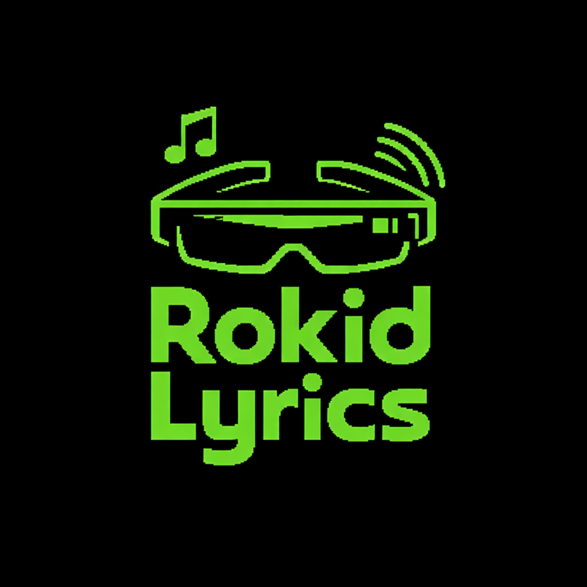

## Rokid Lyrics

Bluetooth-only split product for synced lyrics on Rokid glasses.

Structure:
- `android-phone/`: dedicated Android phone runtime
- `android-glasses/`: dedicated Android glasses client
- `shared-contracts/`: shared Bluetooth wire protocol and lyrics contracts

Design:
- Phone monitors Android media sessions and fetches lyrics from LRCLIB
- Phone serves lyrics over Bluetooth Classic SPP
- Glasses connect over Bluetooth, receive one full lyrics snapshot, then light progress sync events
- Glasses render and advance lyrics locally

Build:
- `android-phone\\gradlew.bat assembleDebug`
- `android-glasses\\gradlew.bat assembleDebug`

First test flow:
- Install the phone APK on the Android phone and the glasses APK on the Rokid device
- Pair the phone and the glasses over Bluetooth at the OS level first
- Open the phone app and grant Bluetooth permission
- Open Android notification access settings from the phone app and enable the listener
- Start Spotify or another media app on the phone
- Open the glasses app and wait for the Bluetooth status to switch to connected
- Press Enter on the glasses if you want to force a lyrics refresh from the phone
