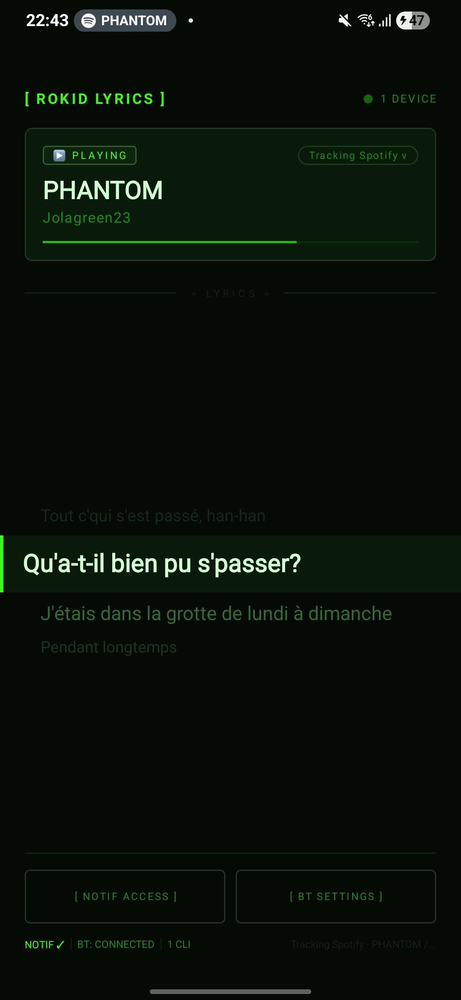
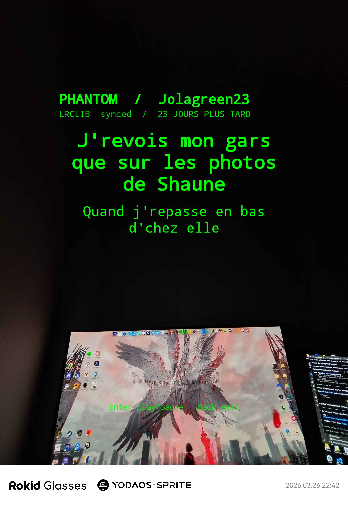

> [!WARNING]
> **Deprecated — superseded by the [Lyrics plugin](https://github.com/Anezium/Rokid-Nexus/tree/main/plugins/lyrics) for [Rokid Nexus](https://github.com/Anezium/Rokid-Nexus).** The plugin brings the same time-synced lyrics to the glasses over the Nexus bus, with no dedicated Bluetooth link to arm, and installs in one tap from the Nexus Store. This app is no longer maintained and will not receive updates.

## Rokid Lyrics

<p align="center">
  
</p>

<p align="center">
  Synced lyrics on Rokid AR glasses, streamed live from your phone over Bluetooth.
</p>

<p align="center">
  <a href="https://ko-fi.com/M8R61ZTXMI" target="_blank">
    
  </a>
</p>

---

## Screenshots

<p align="center">
  
  &nbsp;&nbsp;&nbsp;&nbsp;
  
</p>
<p align="center">
  <em>Phone companion app · Rokid Glasses live display</em>
</p>

---

## Latest update

Spotify's own synced lyrics are now a first-class provider on the phone, ported from the iOS companion app.

- Added a `SPOTIFY` provider at the top of the chain: `Spotify -> Musixmatch -> Netease -> LRCLIB`
- When Spotify is the active player, the app reads the exact track ID from its media session, so Spotify lyrics need no search heuristics at all
- Added an in-app Spotify login that captures the `sp_dc` cookie automatically, plus a manual paste field as fallback; the cookie stays on the device in encrypted storage
- Without the cookie, or for non-Spotify players, the existing chain works exactly as before

Previous chantier: turning the phone app into a real multi-provider lyrics pipeline instead of a single-source prototype (Musixmatch sign-in, lookup dedup, graceful fallback messaging).

---

## How it works

The phone app watches the active Android media session, detects the current track, fetches synced lyrics from a provider chain, and streams the result to the glasses over Bluetooth Classic SPP.

Current provider order:

1. `Spotify` color-lyrics when Spotify is playing and an `sp_dc` cookie is configured
2. `Musixmatch` as the main authenticated provider
3. `Netease` as the secondary fallback
4. `LRCLIB` as the public final fallback

When the glasses connect, they receive a full lyrics snapshot first, then lightweight progress sync events as the song plays so the HUD stays in sync in real time.

No internet is required on the glasses side. No cloud relay. Everything runs locally between the phone and the glasses.

---

## Features

- Time-synced lyrics on Rokid AR glasses for the currently playing track
- Multi-provider lookup pipeline with graceful fallback
- Works with Android media sessions instead of being tied to one specific player
- Runs entirely over Bluetooth between the phone and the glasses
- Press Enter on the glasses to play or pause music on the phone

---

## Project structure

```text
android-phone/       Android phone runtime (media monitor + BT server + lyrics engine)
android-glasses/     Android glasses client (BT client + HUD renderer)
shared-contracts/    Shared Bluetooth wire protocol and lyrics data contracts
design/              UI mockups and design references
```

---

## Build

```bash
# Phone APK
android-phone/gradlew.bat assembleDebug

# Glasses APK
android-glasses/gradlew.bat assembleDebug
```

## Release signing

Release builds read signing values from environment variables or matching Gradle properties:

- `ANDROID_KEYSTORE_PATH`
- `ANDROID_KEYSTORE_PASSWORD`
- `ANDROID_KEY_ALIAS`
- `ANDROID_KEY_PASSWORD`
- `ROKID_LYRICS_VERSION_NAME` (optional)
- `ROKID_LYRICS_VERSION_CODE` (optional)

`assembleRelease` falls back to the debug keystore if those values are absent so you can validate the release path locally or in CI. GitHub Actions uses the real release keystore when all signing secrets are configured, otherwise it falls back to the debug keystore and still publishes release APK artifacts. Partial signing configuration fails the build.

---

## Spotify lyrics (`sp_dc`)

The Spotify provider fetches Spotify's official line-synced lyrics for the exact track playing in the Spotify app. It needs your own `sp_dc` session cookie, and there are two ways to provide it:

**In-app login (easiest).** Tap **[ SET UP SPOTIFY ]** -> **[ LOG IN WITH SPOTIFY ]** and sign in on the Spotify page that opens. The app reads the `sp_dc` cookie from its own WebView the moment the login completes, saves it, and wipes the WebView session — nothing else is kept. The login always starts from a clean session, so a leftover cookie from an old visit can never be captured by mistake.

**Manual paste (fallback).** Grab the cookie from a logged-in Spotify web session on a desktop browser:

1. Open `https://open.spotify.com/` and log in with your own account
2. Open DevTools and go to `Application` -> `Storage` -> `Cookies` -> `https://open.spotify.com`
3. Copy the `Value` of the `sp_dc` cookie
4. Paste it into the same dialog — the raw value, `sp_dc=value`, or a full `Cookie:` header all work

Either way the cookie is stored in encrypted preferences on the phone and never leaves the device. If lookups start reporting an anonymous token, the cookie is stale: log in again from the app, or paste a fresh value.

Keep in mind `sp_dc` is an account session cookie, not an API token — treat it like a password, never share or commit it. Spotify's `color-lyrics` endpoint is an internal API that can change without notice, so this provider is best-effort by design; the rest of the chain covers the gaps.

---

## First run

1. Install `lyrics-phone-debug.apk` on the Android phone and `lyrics-glasses-debug.apk` on the Rokid device
2. Pair the phone and the glasses over Bluetooth at the OS level first
3. Open the phone app and grant Bluetooth and notification permissions
4. Tap **[ NOTIF ACCESS ]** and enable the notification listener for Rokid Lyrics
5. Optional but recommended: sign in to Musixmatch, and paste your Spotify `sp_dc` cookie if you use Spotify (see above)
6. Start playing music on the phone
7. Open the glasses app and wait for the status to show **CONNECTED**
8. Lyrics should appear on the glasses display within a few seconds
9. Press Enter on the glasses to play or pause playback on the phone

## License

Licensed under the [Apache License, Version 2.0](LICENSE). See [NOTICE](NOTICE) for attribution.

Contributions are accepted under the same license (Apache-2.0, section 5) — no CLA required.
